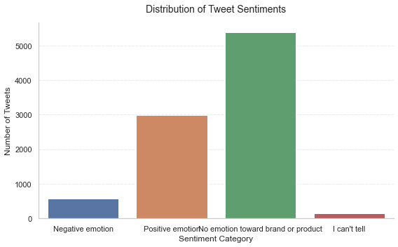
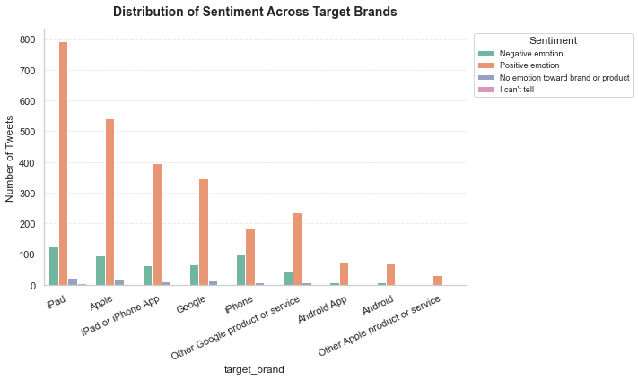
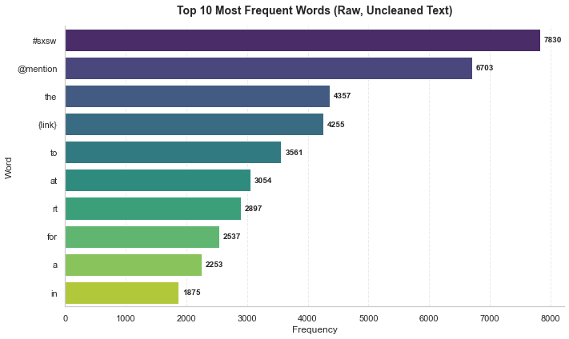
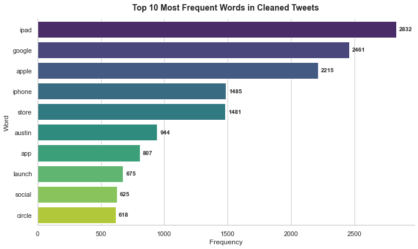

# Twitter Sentiment Analysis of Apple and Google Products

**Author:** Dorcas Ndambuki
---

## 1. BUSINESS UNDERSTANDING

Apple and Google receive thousands of tweets discussing their products. Monitoring customer sentiment manually is inefficient and difficult to scale.

# 1.1.Business Context
Apple and Google operate in a highly competitive, fast-paced consumer tech market. Customer sentiment on social media shifts rapidly in response to product launches, software updates, and public relations events.

---

# 1.2 Business Problem

Apple and Google receive thousands of Tweets/public opinions daily discussing their products and services on Social Media. Brand managers cannot manually monitor the thousands of tweets as is The goal of this project is to build a machine learning model capable of automatically classifying tweet sentiment as positive, negative, or neutral.

# 1.3 Stakeholders

These are the people who will use or benefit from the results of this model
- Brand Managers — (Apple & Google) | Protect and grow the reputation of specific product lines
- Marketing Executives — Design advertising campaigns and launch new products 
- Customer Experience Executives — Oversee the entire customer journey and ensure overall satisfaction
- Business Executives- Make high-level strategic decisions, allocate budgets, and report to investors
- Product Support Teams — Resolve technical issues and assist customers directly 

### 1.4 Business Questions

1. Can tweet sentiment be predicted accurately?
2. Which words most strongly drive positive or negative sentiment?
3. What themes appear in negative feedback for each brand?
4. How can Apple and Google use these insights to improve products and marketing?

### 1.5 Success Metric Selection

Given the severe class imbalance in this dataset (Negative emotion = only ~6% of tweets), **accuracy alone is a misleading metric**. A model that predicts "No emotion" for every tweet would achieve ~60% accuracy while completely failing to detect any negative sentiment.
**Macro Recall** | Primary | Ensures the minority Negative class is detected - most critical for the business |
| **Macro F1** | Secondary | Balances precision and recall equally across all three classes |
| **Accuracy** | Tertiary | Overall correctness, reported for context only |

> **Target:** Macro Recall >= 0.60 and Macro F1 >= 0.65 on the held-out test set.

---

## DATA UNDERSTANDING

### Data Source
- **Source:** CrowdFlower Twitter Sentiment Dataset (via [data.world](https://data.world/crowdflower/brands-and-product-emotions))
- **Size:** ~9,093 tweets, 3 columns
- **Labels:** Human-rated sentiment assigned by CrowdFlower crowd workers

| Column | Description |
|---|---|
| `tweet_text` | Full text of the tweet |
| `emotion_in_tweet_is_directed_at` | Specific product or brand mentioned |
| `is_there_an_emotion_directed_at_a_brand_or_product` | Sentiment label |

| Sentiment | Count | % |
|---|---|---|
| No emotion toward brand or product | ~5,389 | ~59% |
| Positive emotion | ~2,978 | ~33% |
| Negative emotion | ~570 | ~6% |
| I can't tell (removed) | ~156 | ~2% |

> ⚠️ **Class Imbalance:** Negative tweets represent only ~6% of the data. This makes Macro Recall the correct primary metric — accuracy would be misleading.

---
### Data Cleaning and Preparation

To prepare the tweets for machine learning, several preprocessing steps were applied:

### Data Cleaning 

1. Removed missing values
2. Removed ambiguous sentiment labels
3. Consolidated brands into Apple and Google categories
4. Standardized text formatting

### Text Preprocessing

Raw tweets were cleaned through a 7-step pipeline before modeling:

1. Convert to lowercase
2. Remove URLs and `{link}` placeholders
3. Remove HTML artifacts (`&amp;`, `&lt;`)
4. Remove Twitter `@handles`
5. Strip `#` but keep the word
6. Remove punctuation and numbers
7. Tokenize → remove stopwords → lemmatize

This reduced noise and improved feature quality for model training.

## Exploratory Data Analysis
Several visualizations were created to understand the data before modeling.

### Sentiment Distribution
The sentiment distribution revealed a clear class imbalance, with neutral tweets dominating the dataset and negative tweets representing the smallest class.



The dataset shows a clear class imbalance. The majority of tweets express positive sentiment toward the brands, while negative sentiment is significantly underrepresented.

### Brand Distribution
Sentiment was analyzed across Apple and Google brands.



### Key Insights

- Positive sentiment dominates everywhere-indicating overall favorable brand perception.
- No emotions and Icant tell categories are consistently small across all brands indicating clear,strong opinions
- Negative sentiment exists but is much smaller compared to positive,but still doesnt outweigh the positives.
- The dataset is strongly positive on sentiment distribution and differs by brand, suggesting varying levels of customer satisfaction and engagement.

### Top Words Before Cleaning (Raw Text)
Quick word frequency on raw unprocessed tweets - shows the noise problem



### Key EDA Insights

This frequency distribution reveals that raw, uncleaned text is dominated by structural noise rather than sentiment signal.

### Top Words After Cleaning



### Insight

1. The complete elimination of platform tokens (`RT`, `@mention`, `{link}`) confirms that noise was successfully removed.
2. The presence of brand terms (`ipad`, `google`, `apple`, `iphone`) in the top frequency list confirms that TF-IDF vectorization will be highly predictive for downstream classification - these words carry strong brand-sentiment signal.

## MODELLING

All models use a shared `ColumnTransformer` that applies:
- **TF-IDF** (5,000 features, unigrams + bigrams) to the tweet text
- **OneHotEncoding** to the consolidated brand column (Apple / Google / Unknown)

| Model | Type | Notes |
|---|---|---|
| **Logistic Regression** | Baseline | Fast, interpretable, strong NLP benchmark |
| **LinearSVC** | Advanced | Purpose-built for sparse high-dimensional text |
| **XGBoost** | Advanced | Gradient boosting with sequential error correction |

All models used `class_weight='balanced'` to compensate for class imbalance.

## Results

| Model | Macro Recall | Macro F1 | Negative Recall |
|---|---|---|---|
| **Logistic Regression** | **0.60** | Best | **0.60** |
| LinearSVC | 0.48 | - | 0.48 |
| XGBoost | 0.21 | - | 0.21 |

### Confusion Matrix Summary

| Class | Logistic Regression | LinearSVC | XGBoost |
|---|---|---|---|
| Negative (correct) | **0.60** | 0.48 | 0.21 |
| Neutral (correct) | 0.98 | 0.97 | 0.98 |
| Positive (correct) | 0.81 | 0.86 | 0.89 |

---
## Best Model: Logistic Regression

**Logistic Regression was selected as the final model** based on the highest Macro Recall (0.60) — specifically its ability to correctly detect Negative tweets, which is the most business-critical class.

**Why not the others?**
- **LinearSVC** improved Positive recall but dropped Negative recall to 0.48 — a worse outcome for the business
- **XGBoost** achieved the best Positive recall (0.89) but catastrophically failed on Negative sentiment (0.21), misclassifying 69% of negative tweets as Positive — the most damaging possible error for stakeholders.

----
## Key Findings

1. **Negative sentiment is rare but critical** — at only 6% of tweets, it is the hardest class to detect and the most important for the business
2. **Logistic Regression outperforms tree-based models on TF-IDF text** — tree splits are inefficient on sparse 5,000-feature matrices
3. **Top negative drivers for Apple:** battery life, pricing, software crashes, repair costs
4. **Top negative drivers for Google:** privacy concerns, product discontinuations, ad frequency
5. **Accuracy is a misleading metric here** — a model predicting only "No emotion" scores ~60% accuracy while missing every negative tweet

---

## Repository Structure

```
Twitter_Sentiment_Project/
│
├── Twitter_Sentiment_Analysis.ipynb   ← Full CRISP-DM notebook
├── presentation.pdf                   ← Executive summary slides (5-10 min)
├── README.md                          ← This file
└── data/
    └── twitter_sentiment.csv          ← Dataset (CrowdFlower via data.world)
```

## Technologies Used

| Library | Purpose |
|---|---|
| `pandas`, `numpy` | Data manipulation |
| `matplotlib`, `seaborn` | Visualization |
| `nltk` | Text preprocessing |
| `scikit-learn` | Modeling and evaluation |
| `xgboost` | Gradient boosting model |
| `wordcloud` | Word frequency visualization |

```